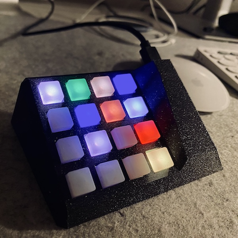

# DIY Streamdeck with the Pimoroni RGB Keypad

This project uses a Raspberry Pi Pico micro controller and an [Pimoroni RGB Keypad](https://shop.pimoroni.com/products/pico-rgb-keypad-base) to provide dynamic app-specific shortcut keys. By monitoring the currently active app on your computer, it automatically loads and displays relevant shortcuts to streamline your workflow and increase productivity.



If you find this project helpful please consider giving it a ⭐️ at [GitHub](https://github.com/LennartHennigs/ESPTelnet) and/or [buy me a ☕️](https://ko-fi.com/lennart0815). Thanks!

**Note:** This was (and is) a very successful experiment in programming with ChatGPT-4. 🤖 I built this without any knowledge of Python or CircuitPython. The goal was to not program it myself but tell ChatGPT-4 what I wanted. This is the result. It wrote the code and this README as well. This paragraph here is the only piece I am writing myself (and about ten lines in the CircuitPython code).

This is also an ongoing project. I just added plugin capabilities to the code.

## Features

For the latest changes and the history of changes, please take a look at the [CHANGELOG](https://github.com/LennartHennigs/DIYStreamDeck/blob/main/CHANGELOG.md).

- Assign keyboard shortcuts or key sequences to keys
- Define shortcuts can or specific apps
- Use the  `_otherwise` section to assign shortcuts for all other apps
- Define "folders" - a new keypad definition scheme that can be tied to a single key
- Define global shortcuts in a `global` section for both, folders and apps 🆕
- Launch applications
- Build your own plugins and its commands. The source includes ...
  - Audio playback plugin
  - Spotify playback plugin
  - Philips Hue plugin
- All key definitions can be defined in a JSON config file stored on the Pi Pico

## Hardware Requirements

- Raspberry Pi Pico
- Pimoroni RGB Keypad for Raspberry Pi Pico
- Micro-USB cable to connect the Pi Pico to your computer

## How it Works

The [`code.py`](https://github.com/LennartHennigs/DIYStreamDeck/blob/main/src/pi_pico/code.py) script reads key definitions from a JSON file and maps them to specific key sequences and LED colors. It listens for the currently active application on the host computer and updates the keypad based on the key mappings for the active application.

The [`watchdog.py`](https://github.com/LennartHennigs/DIYStreamDeck/blob/main/src/mac/watchdog.py) script monitors the currently active application on the host computer and sends its name to the microcontroller connected to the RGB keypad. It also receives `action` commands for plugin events.

## Getting Started

- On the Pi Pico
  - Install CircuitPython on your Raspberry Pi Pico following the instructions [here](https://learn.adafruit.com/welcome-to-circuitpython/installing-circuitpython).
  - Install the required CircuitPython libraries by following the instructions [here](https://learn.adafruit.com/welcome-to-circuitpython/circuitpython-libraries).
  - Clone this repository and copy the contents of the `src/pico` folder to your Raspberry Pi Pico.
  
- On the Mac
  - Copy the content of `src/mac` and its sub folders to your Mac
  - Install [Python3 on your Mac](https://www.freecodecamp.org/news/python-version-on-mac-update/), e.g. [via `brew`](https://brew.sh/)
  - If you want to use the plugins, edit the config files in the `config` directory

- Defining keyboard layout
  - Edit the [`key_def.json`](https://github.com/LennartHennigs/DIYStreamDeck/blob/main/src/pi_pico/key_def.json) file to configure the shortcut keys and colors for your desired apps.

## Configuration

In the [`key_def.json`](https://github.com/LennartHennigs/DIYStreamDeck/blob/main/src/pi_pico/key_def.json) configuration file, each app is defined as a JSON object with key-value pairs, with three entries: `applications`, `folders`, and `global`.

- In the `applications` area the different keys for various apps are defined with the key numbers (0-15).
- The `folders` section defines key sets that can be assigned to a single key.
- In the `global` section are key definitions that are being all apps and folders. They can be "overwritten" via specific folder or app definition. You can set `"ignore_globals": "true"` for folders and apps where they should not be used.
- The `urls` section contains keyboard definitions for Safari and Chrome URls.

These are the possible fields for a key entry:

- `key_sequence`: This field specifies the key combination to be executed when the key is pressed. You can use either a string or an array [to specify the key sequence](https://docs.circuitpython.org/projects/hid/en/latest/_modules/adafruit_hid/keycode.html). If a string is provided, it should contain the keycodes separated by '+' (e.g., "CTRL+ALT+T"). If an array is provided, it should contain the keycodes as separate elements (e.g., ["CTRL", "ALT", "T"]). You can also add delays between key presses within a shortcut by including a floating-point number in the list of keys for a specific shortcut in the key_def.json file. This number represents the delay in seconds between key presses. You can find a list of possible keycodes here.
- `application`: This field is used to specify the application to be launched when an application key is pressed.
- `color`: This field specifies the color of the key, in RGB format. You can specify the color of the key using an RGB string (e.g., "#FF0000" for red, "#00FF00" for green, "#0000FF" for blue).
- `description`: This field provides a description of the function of the key, which is useful for understanding the purpose of each key when printed in the console.
- `folder`: This field allows you assign a "folder" to be opened. The entry also needs the `action` field
- `action`: This field can have the values `close_folder` or an plugin command, e.g. `spotify.next`. The former is mandatory inside a folder definition.

With these fields you can define three types of keys, shortcut keys, application launch keys, and folder keys.

- *Shortcut keys* have a `key_sequence` field which specifies the key combination to be executed when the key is pressed.
- *Application keys* have an `application` field which launches the specified application when the key is pressed.
- *Folder keys*  have an `folder` key and an `action: open_folder` field, when the key is pressed it will load the key definitions.

In addition to the regular shortcut keys for an app, there is a special app key called `_otherwise`, which is used as a fallback when no app definition is found in the JSON file. The `_otherwise` key can include its own set of general-purpose shortcut keys, similar to those defined for "App1". When the Python script is running, it constantly monitors the active application on the computer, and if the active application matches any of the keys in the JSON file, the relevant shortcut keys are loaded onto the keypad. If not, the shortcut keys defined under the "_otherwise" key are loaded onto the keypad.

For example, the configuration could look like this:

``` json
{
  "global": {
    "15": {
      "key_sequence": "GUI+Q",
      "color": "#FF0000",
      "description": "Close App"
    }
  },

  "applications": {
    "zoom.us": {
      "0": {
        "key_sequence": [
          "GUI+SHIFT+A"
        ],
        "color": "#FFFF00",
        "description": "Mute/Unmute Audio"
      },
      "1": {
        "key_sequence": [
          "GUI+SHIFT+V"
        ],
        "color": "#FFFF00",
        "description": "Start/Stop Video"
      },
      "15": {
        "key_sequence": [
          "GUI+W",
          0.1,
          "RETURN"
        ],
        "color": "#FF0000",
        "description": "End Meeting"
      }
    },

    "_otherwise": {
      "0": {
        "key_sequence": [
          "GUI+SPACE"
        ],
        "color": "#FFFFFF",
        "description": "Open Spotlight Search"
      },
      "4": {
        "action": "spotify.prev",
        "color": "#00FF00",
        "description": "Spotify - Previous Song"
      },
      "5": {
        "action": "spotify.playpause",
        "color": "#00FF00",
        "description": "Spotify - Play or Pause"
      },
      "6": {
        "action": "spotify.next",
        "color": "#00FF00",
        "description": "Spotify - Next Song"
      },
      "13": {
        "folder": "apps",
        "color": "#FFFFFF",
        "description": "Apps Folder"
      }
    }
  },

  "folders": {
    "apps": {
      "0": {
        "action": "close_folder",
        "color": "#FFFFFF",
        "description": "Close"
      },
      "12": {
        "application": "zoom.us",
        "color": "#0000FF",
        "description": "Launch Zoom"
      },
      "13": {
        "application": "Slack",
        "color": "#FF0000",
        "description": "Launch Slack"
      }
    }
  }
}
```

In the [`key_def.json`](https://github.com/LennartHennigs/DIYStreamDeck/blob/main/src/pi_pico/key_def.json) file, you will find a special app key called `_otherwise`. This key is used to define shortcut keys that are not specific to any particular app. When the Python script is running, it constantly monitors the active application on your computer, and if the active application matches any of the keys in the JSON file, it will load the relevant shortcut keys onto the keypad. If the active application does not match any of the defined keys, the "_otherwise" key is used as a fallback, and the shortcut keys defined under this key are loaded onto the keypad. This means that you can define a set of general-purpose shortcut keys that are always available, regardless of which application is currently active.

## Plugins 🆕

You can build your own plugins for the keypad. They are stored in the `plugins/` folder. A plugin defines set of commands that can be used in the `action` key in the JSON config. In the JSON above you can see three commands being called in the `_otherwise` section. If needed, the plugin can have a config file to load settings.

### Spotify Plugin 🆕

As an example I included a Spotify plugin called [spotify.py](https://github.com/LennartHennigs/DIYStreamDeck/blob/main/src/mac/plugins/spotify.py).
The Spotify plugin has the following commands:

- spotify.play
- spotify.pause
- spotify.playpause
- spotify.next
- spotify.prev
- spotify.volume_up
- spotify.volume_down

To use it you need to have a Spotify premium account and need to add you API credentials to the [spotify.json](https://github.com/LennartHennigs/DIYStreamDeck/blob/main/src/mac/plugins/config/spotify.json) config file.

### Hue Plugin 🆕

- hue.turn_off [Lamp ID | 'Lamp Name']
- hue.turn_on [Lamp ID | 'Lamp Name']
- hue.turn_toggle [Lamp ID | 'Lamp Name']

You need to define the IP address of your hue bridge in the config JSON and press its connect button on first run. Provide the ID of your lamp or its name enclosed in single quotes.

### Audio Playback Plugin 🆕

- sounds.play ['File Name']
- sounds.stop

The plugin can playback `.wav` and `.mp3` files.

## Watchdog

To enable the dynamic detection of the active app, you need to run a watchdog script on your computer that sends the active app's name to the Pi Pico via USB serial. This project includes a Python watchdog script specifically designed for macOS.

To run the watchdog script, navigate to the directory containing the watchdog.py file and execute the following command, e.g.:

``` bash
python3 watchdog.py --port /dev/cu.usbmodem2101 --speed 9600 --verbose
```

- The `--port` parameter needs to be set to the USB serial port corresponding to your Raspberry Pi Pico (e.g., `/dev/cu.usbmodem2101`).
- The optional `--speed` parameter should be set to the desired baud rate for the serial communication (default: `9600`).
- If the optional `--verbose` parameter is set, the current app will be printed to the console.

When the watchdog script detects a change in the active app, it sends the app's name as a single line over the USB serial connection. The Pi Pico then reads this information, loads the corresponding shortcuts from the `key_def.json` file, and updates the keypad accordingly.
