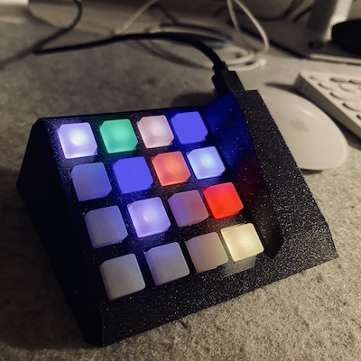

# DIY Streamdeck with the Pimoroni RGB Keypad

A Raspberry Pi Pico + [Pimoroni RGB Keypad](https://shop.pimoroni.com/products/pico-rgb-keypad-base) that provides dynamic, app-specific shortcut keys driven by a Mac watchdog script.



If you find this useful, consider giving it a ⭐️ on [GitHub](https://github.com/LennartHennigs/DIYStreamDeck) or [buying me a ☕️](https://ko-fi.com/lennart0815).

---

## Features

- App-specific key layouts that switch automatically when you change applications
- Four key types: **shortcut**, **application launch**, **folder** (sub-pages), and **action** (plugin commands)
- Global `_default` keys added to every app/folder, with per-entry opt-out via `ignore_default`
- Fallback `_otherwise` layout for apps without a specific definition
- Plugins for Spotify, Philips Hue, and audio playback
- Rotate the layout CW or CCW for 3D-printed cases
- All configuration lives in a single [`key_def.json`](src/pi_pico/key_def.json) on the Pico

---

## Hardware

- Raspberry Pi Pico
- Pimoroni RGB Keypad for Raspberry Pi Pico
- Micro-USB cable
- A Mac running `watchdog.py` (required for app detection and plugins)

---

## How It Works

**`code.py`** (CircuitPython, runs on the Pico) reads `key_def.json` and maps keys to sequences and LED colors. It listens over USB serial for the active app name and updates the layout accordingly.

**`watchdog.py`** (Python, runs on Mac) monitors the active application using Cocoa notifications and sends it to the Pico. It also handles plugin commands. Without it, the keypad works as a static shortcut pad only.

---

## Getting Started

### Pi Pico

1. [Install CircuitPython](https://learn.adafruit.com/welcome-to-circuitpython/installing-circuitpython) on the Pico.
2. Install required libraries into `lib/`: `adafruit_dotstar.mpy`, `adafruit_hid`, and [rgbkeypad-circuitpython](https://github.com/AngainorDev/rgbkeypad-circuitpython).
3. Copy `src/pi_pico/` to the Pico root.
4. Edit `key_def.json` to set up your layouts. Key `0` is top-left, `15` is bottom-right. [Thonny](https://thonny.org/) makes this easy.

### Mac Watchdog

```bash
cd src/mac
python3 -m venv venv && source venv/bin/activate
pip install -r requirements.txt

# Run — port is auto-detected
python3 watchdog.py --verbose

# Or specify a port explicitly
python3 watchdog.py --port /dev/cu.usbmodem2101 --verbose
```

Or use the launcher script from the repo root:

```bash
# Auto-detect
./run-mac-watchdog.sh --verbose

# Or specify a port
./run-mac-watchdog.sh --port /dev/cu.usbmodem2101 --verbose
```

**Watchdog flags:**

| Flag | Description |
| --- | --- |
| `--port` | Serial port for the Pico (optional — auto-detected if omitted) |
| `--speed` | Baud rate (default: `9600`) |
| `--verbose` | Print active app name to console |
| `--rotate` | Rotate layout: `CW` or `CCW` |

---

## Configuration (`key_def.json`)

The file has four top-level sections: `settings`, `applications`, `folders`, `urls`.

### Settings

```json
{ "settings": { "rotate": "CCW" } }
```

`rotate` accepts `CW`, `CCW`, or omit for no rotation.

### Key Types

| Type | Field | Behaviour |
| --- | --- | --- |
| Shortcut | `key_sequence` | Sends a key combination |
| String | `string` | Types literal text character-by-character |
| App launch | `application` | Opens or focuses an app |
| Folder | `folder` | Opens a sub-page of keys |
| Action | `action` | Runs a plugin command or `close_folder` |

**Common fields** (any key type):

- `color` — LED color as `#RRGGBB`
- `pressedColor` — color while held
- `toggleColor` — color for toggled/active state
- `description` — label printed in `--verbose` output

**Shortcut-specific:**

- `key_sequence` — keycode string `"CTRL+ALT+T"`, array `["CTRL","ALT","T"]`, or array with float delays between presses
- `pressedUntilReleased: true` — holds the key until physically released

**String-specific:**

- `string` — literal text to type (e.g. `"TODO: "`)
- `string_delay` — delay in seconds between characters (default: `0.05`; `0` to type instantly)

**App-specific:**

- `alias_of` — copy another app's layout instead of defining keys

**Folder-specific:**

- `autoclose: false` — keep folder open after a key press (default: auto-closes)
- Folders without `autoclose` must include a `close_folder` action key

**App/folder/URL:**

- `ignore_default: true` — skip global `_default` keys for this entry

### Example

```json
{
  "settings": { "rotate": "CCW" },

  "applications": {
    "_default": {
      "15": { "key_sequence": "GUI+Q", "color": "#FF0000", "description": "Close App" }
    },

    "zoom.us": {
      "0":  { "key_sequence": "GUI+SHIFT+A", "color": "#FFFF00", "description": "Mute/Unmute" },
      "1":  { "key_sequence": "GUI+SHIFT+V", "color": "#FFFF00", "description": "Start/Stop Video" },
      "15": { "key_sequence": ["GUI+W", 0.1, "RETURN"], "color": "#FF0000", "description": "End Meeting" }
    },

    "_otherwise": {
      "0":  { "key_sequence": "GUI+SPACE",       "color": "#FFFFFF", "description": "Spotlight" },
      "4":  { "action": "spotify.prev",           "color": "#00FF00", "description": "Previous" },
      "5":  { "action": "spotify.playpause",      "color": "#00FF00", "description": "Play/Pause" },
      "6":  { "action": "spotify.next",           "color": "#00FF00", "description": "Next" },
      "13": { "folder": "apps",                   "color": "#FFFFFF", "description": "Apps" }
    }
  },

  "folders": {
    "apps": {
      "0":  { "action": "close_folder",  "color": "#FFFFFF", "description": "Close" },
      "12": { "application": "zoom.us",  "color": "#0000FF", "description": "Zoom" },
      "13": { "application": "Slack",    "color": "#FF0000", "description": "Slack" }
    }
  }
}
```

> **Note:** `watchdog.py` detects URL changes only when Chrome or Safari *becomes active*, not on tab switches.

---

## Plugins

Plugins live in `src/mac/plugins/` and extend `BasePlugin`. Config files go in `src/mac/plugins_config/` (git-ignored — copy from the `.json.example` templates).

### Spotify

Requires a Spotify Premium account. Add credentials to `plugins_config/spotify.json`.

| Command | Description |
| --- | --- |
| `spotify.play` | Resume playback |
| `spotify.pause` | Pause |
| `spotify.playpause` | Toggle play/pause |
| `spotify.next` | Next track |
| `spotify.prev` | Previous track |
| `spotify.volume_up` | Volume +10% |
| `spotify.volume_down` | Volume −10% |

### Philips Hue

Set the bridge IP in `plugins_config/hue.json` and press the bridge button on first run. Lamp identifier can be a name in single quotes or a numeric index.

| Command | Description |
| --- | --- |
| `hue.turn_on 'Lamp Name'` | Turn on a light |
| `hue.turn_off 'Lamp Name'` | Turn off a light |
| `hue.toggle 'Lamp Name'` | Toggle a light |

### Sounds

Place `.wav` or `.mp3` files in `src/mac/sounds/` (configure path in `plugins_config/sounds.json`).

| Command | Description |
| --- | --- |
| `sounds.play 'file.mp3'` | Play a sound file |
| `sounds.stop` | Stop playback |

---

## Testing

```bash
# First-time setup
python3 -m venv test_venv && source test_venv/bin/activate
pip install -r tests/requirements_test.txt

# Run tests
./run-tests.sh all       # everything (255 tests)
./run-tests.sh pico      # Pi Pico only
./run-tests.sh mac       # Mac/watchdog only
./run-tests.sh security  # security tests only
```

See [`tests/CLAUDE.md`](tests/CLAUDE.md) for full details.

---

## 3D Printed Case

The case in the photo is [this Printables model](https://www.printables.com/model/80088-pimoroni-keypad-case/). It rotates the keypad — use `"rotate": "CCW"` (or `"CW"`) in `settings` to compensate.
